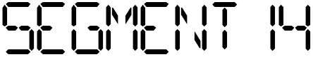
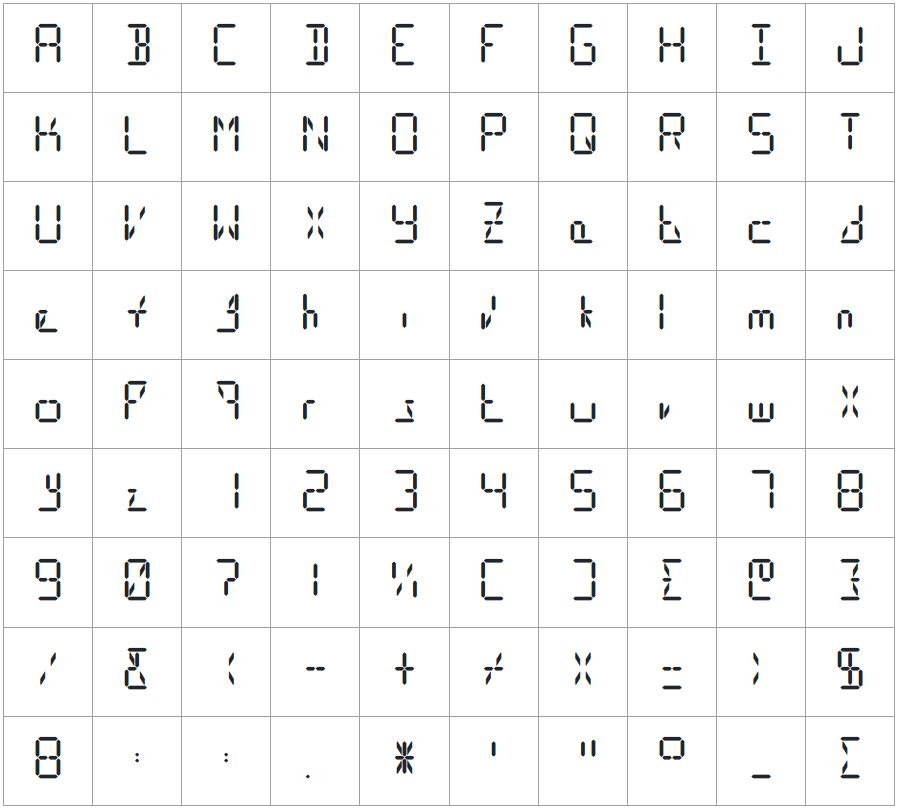

<h2>Segment14 is a font (made by me) that represents a lcd display with 14 segments. You can use it for free, no credits required!</h2>

<h3>You can download the font using the following links:</h3>

[![apk](https://img.shields.io/badge/Font_file_.ttf-Download-FBD75B?logo=data:image/svg%2bxml;base64,PHN2ZyB4bWxucz0iaHR0cDovL3d3dy53My5vcmcvMjAwMC9zdmciIGhlaWdodD0iMjRweCIgdmlld0JveD0iMCAtOTYwIDk2MCA5NjAiIHdpZHRoPSIyNHB4IiBmaWxsPSIjRkZGRkZGIj48cGF0aCBkPSJNNDgwLTM0Mi4wMnEtOC45NiAwLTE3LjE1LTMuMS04LjItMy4xLTE0LjkyLTkuODFMMzAwLjM1LTUwMi41MnEtMTMuNDQtMTMuNDQtMTMuMDYtMzEuODMuMzgtMTguMzkgMTMuMDYtMzEuODIgMTMuNjctMTMuNjggMzIuMzItMTQuMDYgMTguNjYtLjM4IDMyLjMzIDEzLjI5bDY5LjUgNjkuNXYtMjY1LjE5cTAtMTkuMTUgMTMuMTctMzIuMzMgMTMuMTgtMTMuMTcgMzIuMzMtMTMuMTd0MzIuMzMgMTMuMTdxMTMuMTcgMTMuMTggMTMuMTcgMzIuMzN2MjY1LjE5bDY5LjUtNjkuNXExMy40My0xMy42NyAzMi4wOS0xMy40MSAxOC42NS4yNiAzMi4zMiAxMy45NCAxMi45MiAxMy42NyAxMy4zIDMxLjk0LjM4IDE4LjI3LTEzLjMgMzEuOTVMNTEyLjA3LTM1NC45M3EtNi43MiA2LjcxLTE0LjkyIDkuODEtOC4xOSAzLjEtMTcuMTUgMy4xWk0yNDIuODctMTUxLjg3cS0zNy43OCAwLTY0LjM5LTI2LjYxdC0yNi42MS02NC4zOXYtNzQuNXEwLTE5LjE1IDEzLjE3LTMyLjMzIDEzLjE4LTEzLjE3IDMyLjMzLTEzLjE3dDMyLjMzIDEzLjE3cTEzLjE3IDEzLjE4IDEzLjE3IDMyLjMzdjc0LjVoNDc0LjI2di03NC41cTAtMTkuMTUgMTMuMTctMzIuMzMgMTMuMTgtMTMuMTcgMzIuMzMtMTMuMTd0MzIuMzMgMTMuMTdxMTMuMTcgMTMuMTggMTMuMTcgMzIuMzN2NzQuNXEwIDM3Ljc4LTI2LjYxIDY0LjM5dC02NC4zOSAyNi42MUgyNDIuODdaIi8+PC9zdmc+)](https://hms-douglas.github.io/segment14/Fonts/Segment14.ttf)

[![apk](https://img.shields.io/badge/Font_file_.woff-Download-FBD75B?logo=data:image/svg%2bxml;base64,PHN2ZyB4bWxucz0iaHR0cDovL3d3dy53My5vcmcvMjAwMC9zdmciIGhlaWdodD0iMjRweCIgdmlld0JveD0iMCAtOTYwIDk2MCA5NjAiIHdpZHRoPSIyNHB4IiBmaWxsPSIjRkZGRkZGIj48cGF0aCBkPSJNNDgwLTM0Mi4wMnEtOC45NiAwLTE3LjE1LTMuMS04LjItMy4xLTE0LjkyLTkuODFMMzAwLjM1LTUwMi41MnEtMTMuNDQtMTMuNDQtMTMuMDYtMzEuODMuMzgtMTguMzkgMTMuMDYtMzEuODIgMTMuNjctMTMuNjggMzIuMzItMTQuMDYgMTguNjYtLjM4IDMyLjMzIDEzLjI5bDY5LjUgNjkuNXYtMjY1LjE5cTAtMTkuMTUgMTMuMTctMzIuMzMgMTMuMTgtMTMuMTcgMzIuMzMtMTMuMTd0MzIuMzMgMTMuMTdxMTMuMTcgMTMuMTggMTMuMTcgMzIuMzN2MjY1LjE5bDY5LjUtNjkuNXExMy40My0xMy42NyAzMi4wOS0xMy40MSAxOC42NS4yNiAzMi4zMiAxMy45NCAxMi45MiAxMy42NyAxMy4zIDMxLjk0LjM4IDE4LjI3LTEzLjMgMzEuOTVMNTEyLjA3LTM1NC45M3EtNi43MiA2LjcxLTE0LjkyIDkuODEtOC4xOSAzLjEtMTcuMTUgMy4xWk0yNDIuODctMTUxLjg3cS0zNy43OCAwLTY0LjM5LTI2LjYxdC0yNi42MS02NC4zOXYtNzQuNXEwLTE5LjE1IDEzLjE3LTMyLjMzIDEzLjE4LTEzLjE3IDMyLjMzLTEzLjE3dDMyLjMzIDEzLjE3cTEzLjE3IDEzLjE4IDEzLjE3IDMyLjMzdjc0LjVoNDc0LjI2di03NC41cTAtMTkuMTUgMTMuMTctMzIuMzMgMTMuMTgtMTMuMTcgMzIuMzMtMTMuMTd0MzIuMzMgMTMuMTdxMTMuMTcgMTMuMTggMTMuMTcgMzIuMzN2NzQuNXEwIDM3Ljc4LTI2LjYxIDY0LjM5dC02NC4zOSAyNi42MUgyNDIuODdaIi8+PC9zdmc+)](https://hms-douglas.github.io/segment14/Fonts/Segment14.woff)

[![apk](https://img.shields.io/badge/SVGs-Generate-FBD75B?logo=data:image/svg%2bxml;base64,PHN2ZyB4bWxucz0iaHR0cDovL3d3dy53My5vcmcvMjAwMC9zdmciIGhlaWdodD0iMjRweCIgdmlld0JveD0iMCAtOTYwIDk2MCA5NjAiIHdpZHRoPSIyNHB4IiBmaWxsPSIjRkZGRkZGIj48cGF0aCBkPSJNNDgwLTM0Mi4wMnEtOC45NiAwLTE3LjE1LTMuMS04LjItMy4xLTE0LjkyLTkuODFMMzAwLjM1LTUwMi41MnEtMTMuNDQtMTMuNDQtMTMuMDYtMzEuODMuMzgtMTguMzkgMTMuMDYtMzEuODIgMTMuNjctMTMuNjggMzIuMzItMTQuMDYgMTguNjYtLjM4IDMyLjMzIDEzLjI5bDY5LjUgNjkuNXYtMjY1LjE5cTAtMTkuMTUgMTMuMTctMzIuMzMgMTMuMTgtMTMuMTcgMzIuMzMtMTMuMTd0MzIuMzMgMTMuMTdxMTMuMTcgMTMuMTggMTMuMTcgMzIuMzN2MjY1LjE5bDY5LjUtNjkuNXExMy40My0xMy42NyAzMi4wOS0xMy40MSAxOC42NS4yNiAzMi4zMiAxMy45NCAxMi45MiAxMy42NyAxMy4zIDMxLjk0LjM4IDE4LjI3LTEzLjMgMzEuOTVMNTEyLjA3LTM1NC45M3EtNi43MiA2LjcxLTE0LjkyIDkuODEtOC4xOSAzLjEtMTcuMTUgMy4xWk0yNDIuODctMTUxLjg3cS0zNy43OCAwLTY0LjM5LTI2LjYxdC0yNi42MS02NC4zOXYtNzQuNXEwLTE5LjE1IDEzLjE3LTMyLjMzIDEzLjE4LTEzLjE3IDMyLjMzLTEzLjE3dDMyLjMzIDEzLjE3cTEzLjE3IDEzLjE4IDEzLjE3IDMyLjMzdjc0LjVoNDc0LjI2di03NC41cTAtMTkuMTUgMTMuMTctMzIuMzMgMTMuMTgtMTMuMTcgMzIuMzMtMTMuMTd0MzIuMzMgMTMuMTdxMTMuMTcgMTMuMTggMTMuMTcgMzIuMzN2NzQuNXEwIDM3Ljc4LTI2LjYxIDY0LjM5dC02NC4zOSAyNi42MUgyNDIuODdaIi8+PC9zdmc+)](https://hms-douglas.github.io/segment14)

[![apk](https://img.shields.io/badge/PNGs-Generate-FBD75B?logo=data:image/svg%2bxml;base64,PHN2ZyB4bWxucz0iaHR0cDovL3d3dy53My5vcmcvMjAwMC9zdmciIGhlaWdodD0iMjRweCIgdmlld0JveD0iMCAtOTYwIDk2MCA5NjAiIHdpZHRoPSIyNHB4IiBmaWxsPSIjRkZGRkZGIj48cGF0aCBkPSJNNDgwLTM0Mi4wMnEtOC45NiAwLTE3LjE1LTMuMS04LjItMy4xLTE0LjkyLTkuODFMMzAwLjM1LTUwMi41MnEtMTMuNDQtMTMuNDQtMTMuMDYtMzEuODMuMzgtMTguMzkgMTMuMDYtMzEuODIgMTMuNjctMTMuNjggMzIuMzItMTQuMDYgMTguNjYtLjM4IDMyLjMzIDEzLjI5bDY5LjUgNjkuNXYtMjY1LjE5cTAtMTkuMTUgMTMuMTctMzIuMzMgMTMuMTgtMTMuMTcgMzIuMzMtMTMuMTd0MzIuMzMgMTMuMTdxMTMuMTcgMTMuMTggMTMuMTcgMzIuMzN2MjY1LjE5bDY5LjUtNjkuNXExMy40My0xMy42NyAzMi4wOS0xMy40MSAxOC42NS4yNiAzMi4zMiAxMy45NCAxMi45MiAxMy42NyAxMy4zIDMxLjk0LjM4IDE4LjI3LTEzLjMgMzEuOTVMNTEyLjA3LTM1NC45M3EtNi43MiA2LjcxLTE0LjkyIDkuODEtOC4xOSAzLjEtMTcuMTUgMy4xWk0yNDIuODctMTUxLjg3cS0zNy43OCAwLTY0LjM5LTI2LjYxdC0yNi42MS02NC4zOXYtNzQuNXEwLTE5LjE1IDEzLjE3LTMyLjMzIDEzLjE4LTEzLjE3IDMyLjMzLTEzLjE3dDMyLjMzIDEzLjE3cTEzLjE3IDEzLjE4IDEzLjE3IDMyLjMzdjc0LjVoNDc0LjI2di03NC41cTAtMTkuMTUgMTMuMTctMzIuMzMgMTMuMTgtMTMuMTcgMzIuMzMtMTMuMTd0MzIuMzMgMTMuMTdxMTMuMTcgMTMuMTggMTMuMTcgMzIuMzN2NzQuNXEwIDM3Ljc4LTI2LjYxIDY0LjM5dC02NC4zOSAyNi42MUgyNDIuODdaIi8+PC9zdmc+)](https://hms-douglas.github.io/segment14)

<h3>The font has the following symbols:</h3>

